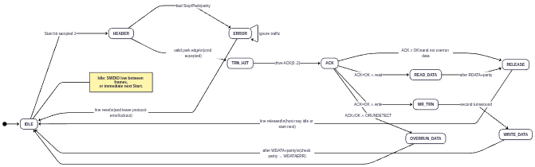
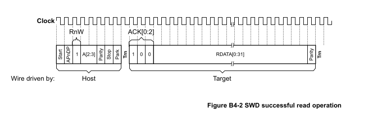
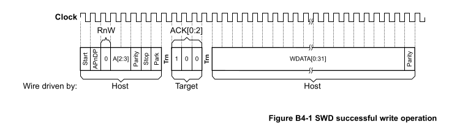

# Phase 2A — SWD Protocol State Machine: Implementation & Verification

**Status:** implemented and sim-verified.

**Tasks** :
- [x] Define the internal 2A↔2B transaction seam first: `SwdDpCmd`/`SwdDpRsp`/`SwdDpWrite` flows so 2A is verifiable standalone against a stubbed DP
- [x] Implement 2-wire physical interface on the **target**: `swclk` **input** (driven by probe) + `swdio` as `i`/`o`/`oe` (tristate/IOBUF at SoC level)
- [x] Implement packet request parser — 8-bit frame: Start(1), APnDP(1), RnW(1), A[2:3](2), Parity(1), Stop(1), Park(1)
- [x] Implement ACK response generator — 3-bit ACK[2:0]: OK(0b001), WAIT(0b010), FAULT(0b100) (ADIv6.0 Table B4-1). Transmitted LSB-first like all SWD data, so OK appears on the wire as `1,0,0` — do not confuse wire order with the register value
- [x] Implement turnaround period management — direction change on SWDIO between host-driven and target-driven phases (Sec B4.1.3); fixed at 1 cycle (`DLCR.TURNROUND` unsupported)
- [x] Implement WDATA phase — 33-bit host→target: WDATA[0:31] + parity (for write operations after OK ACK)
- [x] Implement RDATA phase — 33-bit target→host: RDATA[0:31] + parity (for read operations after OK ACK)
- [x] Implement even parity checker/generator — separate parity on packet request (4 bits: APnDP, RnW, A[2:3]) and data transfer (32 bits) (Sec B4.1.6)
- [x] Implement LSB-first bit ordering for all data values (Sec B4.1.5)
- [x] Accept idle cycles between transactions (Sec B4.1.4); back-to-back with zero idle also works
- [x] Implement line reset detection — 50+ clock cycles with SWDIO HIGH, followed by 2+ idle cycles (Sec B4.3.3)
- [x] Start with SWD protocol version 1 (point-to-point); version 2 multi-drop support is optional; no ORUNDETECT

---

**Code Repository :**

Update submodules in [pythondata-cpu-vexriscv_smp](https://github.com/disdi/pythondata-cpu-vexriscv_smp) to below :

- SpinalHdl - https://github.com/disdi/SpinalHDL/tree/phase2a
- VexRiscv - https://github.com/disdi/VexRiscv/tree/phase2a

| Artifact | Path |
|---|---|
| RTL | `EXT/SpinalHDL/lib/src/main/scala/spinal/lib/cpu/riscv/debug/DebugTransportModuleSwd.scala` |
| Testbench | `EXT/VexRiscv/src/test/scala/vexriscv/DebugSwdTest.scala` |
| Run | `cd EXT/VexRiscv && sbt -batch "testOnly vexriscv.DebugSwdTest"` |

`EXT` = `pythondata-cpu-vexriscv-smp/pythondata_cpu_vexriscv_smp/verilog/ext`. `EXT/VexRiscv/build.sbt` compiles `EXT/SpinalHDL` from source, so the RTL and
testbench build in one sbt project with **no LiteX involvement**.

---

## 1. What is implemented — `SwdPhy`

`SwdPhy` is the ARM ADI SW-DP **line layer** (ADIv6.0 §B4): it speaks the 2-wire protocol
and terminates in a decoded-transaction seam. It contains no DP registers (Phase 2B) and no
`DebugBus` bridge (Phase 2C).

### 1.1 I/O

```text
swdio.i  : in  Bool   -- SWDIO as driven by the probe
swdio.o  : out Bool   -- SWDIO value when the target drives
swdio.oe : out Bool   -- target output enable
dp.cmd   : master Flow(SwdDpCmd)    -- decoded request        (2A -> 2B)
dp.rsp   : slave  Flow(SwdDpRsp)    -- ACK + read data        (2B -> 2A)
dp.wr    : master Flow(SwdDpWrite)  -- write commit           (2A -> 2B)
```

- **Clock = SWCLK.** The component's implicit clock domain is the probe-driven SWCLK.
  The target samples `swdio.i` and updates `swdio.o`/`swdio.oe` on the **rising edge**,
  matching the OpenOCD bitbang model (host sets data while SWCLK is low, samples target
  data while low).
- **No `inout`.** The tristate split (`i`/`o`/`oe`) is required because the cluster is a
  Verilog black box in LiteX.

### 1.2 The 2A↔2B seam (three flows)

A wire-protocol fact shapes the seam: **a write's ACK is sent before the 33-bit WDATA
phase**, so write data cannot ride in the request.

| Flow | Fired | Payload |
|---|---|---|
| `SwdDpCmd` | one-cycle pulse on the packet-request park edge, iff parity/stop/park all pass | `apNdp`, `rnw`, `addr = A[3:2]` |
| `SwdDpRsp` | must be presented by the DP **within the turnaround cycle** (an always-ready DP may simply hold it valid) | `ack` (OK=001/WAIT=010/FAULT=100), `rdata` |
| `SwdDpWrite` | one-cycle pulse after the 33rd WDATA bit | `data`, `parityOk` (false ⇒ WDATAERR material for 2B) |

The response is latched into a hold register on first sight (`rsp.valid` may be
combinational off `cmd` or held continuously); ACK and RDATA are driven from the
latched copy for the rest of the frame.

### 1.3 Frame timing (rising-edge numbering)

Request bits are sampled at edges `e1..e8` (start, APnDP, RnW, A2, A3, parity, stop, park —
LSB first). `cmd` fires at `e8`.

**Read, ACK=OK** (one turnaround each way, target keeps the line between ACK and RDATA):

```text
e1..e8   host request          (target oe=0)
e9       turnaround            -> target drives ACK[0] at e9
e9..e11  ACK[0..2]
e12..e43 RDATA[0..31]          (from rsp.rdata, LSB first)
e44      even parity of RDATA
e45      release (oe -> 0)     turnaround back to host
```

**Write, ACK=OK** (two turnarounds around the ACK — the bug the tests caught: sampling one
edge early captures the turnaround as data bit 0):

```text
e1..e8   host request
e9       turnaround            -> target drives ACK[0]
e9..e11  ACK[0..2]
e12      release (oe -> 0)     \  second turnaround: host takes the line,
e13      turnaround bit period /  drives its first WDATA bit after it
e14..e45 WDATA[0..31]          sampled LSB first into a shift register
e46      parity bit            -> dp.wr fires with data + parityOk verdict
```

**WAIT/FAULT** (either direction): the data phase is skipped — after ACK[2] the target
releases immediately and returns to idle. (No ORUNDETECT support, so this is unconditional.)

### 1.4 FSM

States: `IDLE → HEADER → ACK → {READ_DATA | WR_TRN → WRITE_DATA | RELEASE} → IDLE`, plus
`ERROR` and `RESET_WAIT` (power-up init is `RESET_WAIT`, so the target stays quiet until
the line is seen low once).

- **Protocol error** (request parity, stop≠0, park≠1): enter `ERROR` — the target stops
  driving and ignores all traffic until line reset (ADIv6.0 §B4.2.5).
- **Line reset detector** (independent of the FSM): a saturating counter of consecutive
  `swdio.i == 1` samples while the target is not driving; at **50** it forces
  `RESET_WAIT` from *any* state (including `ERROR`), which falls to `IDLE` on the first
  low (idle) cycle. The counter is frozen/cleared while `oe=1` so target-driven phases
  can't fake a reset.

#### 1.4.1 Target state machine for one frame (implementation-oriented)

A practical encoding of Section B4.1–B4.2 from the specification for a **single transaction** on the target.

This section has two layers:

1. **§1.4.2 abstract diagram** — phase names aligned with ADI figures (includes `TRN_H2T` and
   optional `OVERRUN_DATA`).
2. **§1.4.3–§1.4.5 Phase 2A `SwdPhy`** — how that diagram maps onto the RTL enum and transitions in
   `DebugTransportModuleSwd.scala` (`case class SwdPhy`).

---

#### 1.4.2 Abstract one-frame FSM (spec-oriented)



---


#### 1.4.3 State inventory — diagram §1.4.2 ↔ RTL

| Diagram §1.4.2 | RTL `EState` | Role |
|--------------|--------------|------|
| `IDLE` | `IDLE` | Wait for Start; between frames (`oDrive := False`) |
| `HEADER` | `HEADER` | LSB-first shift-in after Start; validate at park |
| `TRN_H2T` | *(no named state)* | **Folded into first cycle of `ACK`** |
| `ACK` | `ACK` | Drive ACK[0..2] from `ackNow` / `rspHold` (`cnt` 0..2) |
| `READ_DATA` | `READ_DATA` | RDATA[0:31] + even parity; keep `oe=1` after ACK |
| `WR_TRN` | `WR_TRN` | Post-ACK turnaround before write (`oe=0`, 2 cycles) |
| `WRITE_DATA` | `WRITE_DATA` | Sample WDATA + parity → `dp.wr` |
| `RELEASE` | `RELEASE` | Release after target-driven phase → `IDLE` |
| `ERROR` | `ERROR` | Protocol error: do not drive; ignore headers |
| `OVERRUN_DATA` | **absent** | ORUNDETECT out of scope (WAIT/FAULT always skip data) |
| *(recovery)* | `RESET_WAIT` | After line-reset hit; leave on first low → `IDLE` |

---

#### 1.4.4 Transition mapping (diagram → RTL)

#### `IDLE → HEADER` — Start bit = 1

| Diagram | RTL |
|---------|-----|
| Start sampled 1 | `when(dio) { state := HEADER; cnt := 0 }` in `IDLE` |

Start is **not** stored in `hdr`; it only opens the header window. Remaining bits are shifted in `HEADER`.

#### `HEADER → ERROR` or valid exit

On park edge (`cnt === 6`), `hdr` holds APnDP…Stop and `dio` is Park:

| Check | RTL | Spec |
|-------|-----|------|
| Even parity of APnDP, RnW, A2, A3 | `(apNdp ^ rnw ^ a2 ^ a3) === hdr(4)` | B4.1.6 / B4.2.5 |
| Stop = 0 | `stopOk = !hdr(5)` | B4.2.5 |
| Park = 1 | `dio` on that edge | B4.2.5 |

- Fail → `ERROR` (silent until line reset).
- Pass → `cmdValid` pulse (`SwdDpCmd`: `apNdp`, `rnw`, `addr`) and `state := ACK`  
  (“cmd accepted” on the diagram’s park edge).

#### Where is diagram `TRN_H2T`?

There is **no** `TRN_H2T` state. Comment in RTL: *“next cycle is the turnaround”* after park, then `ACK` both:

1. owns the host→target turnaround cycle (from the host’s view), and  
2. drives the three ACK bits.

| Edge | Diagram name | RTL |
|------|----------------|-----|
| Park | end of `HEADER` | `HEADER` → schedule `ACK`, fire `cmd` |
| Next rising edge | `TRN_H2T` / first ACK drive | First `ACK` cycle: `oe=1`, `ACK[0]` |
| Next two edges | rest of `ACK` | `ACK[1]`, `ACK[2]` (`cnt` 1, 2) |

So diagram **`TRN_H2T` + `ACK`** collapse into RTL **`ACK` with `cnt = 0,1,2`**. Same wire timing as Fig B4-1/B4-2; one fewer named state.

#### `ACK → …` after three ACK bits (`cnt === 2`)

| Diagram edge | RTL | Match? |
|--------------|-----|--------|
| OK ∧ read → `READ_DATA` | `ackNow === OK && cmdPayload.rnw` → `READ_DATA` | Exact |
| OK ∧ write → `WR_TRN` | `ackNow === OK && !rnw` → `WR_TRN` | Exact |
| ≠OK, no overrun → `RELEASE` | else → `RELEASE` | Exact |
| ≠OK ∧ ORUNDETECT → `OVERRUN_DATA` | **never** | By design (scope) |

ACK value comes from the **2B seam**, not sticky logic inside 2A:

- `io.dp.rsp` → latched in `rspHold` when `valid`
- `ackNow = Mux(rsp.valid, rsp.ack, rspHold.ack)`
- Encoded LSB-first on the wire: OK=`001`, WAIT=`010`, FAULT=`100`

#### Read path — `READ_DATA → RELEASE → IDLE` (Fig B4-2)




- 32 data bits LSB-first from `rspHold.rdata`, then even parity (`xorR`).
- No turnaround between ACK and RDATA (target keeps `oe=1`).
- `RELEASE`: `oDrive := False`, then `IDLE` (trailing Trn / release).

#### Write path — `WR_TRN → WRITE_DATA → IDLE` (Fig B4-1)




- `WR_TRN`: two cycles with `oe=0` (`cnt` 0 then 1) = second turnaround.
- `WRITE_DATA`: shift in 32 bits + sample parity; fire `dp.wr` with `data` and `parityOk`.
- WDATA parity fail → `parityOk = false` (WDATAERR **material for 2B**), **not** protocol error.
- Return **direct** `WRITE_DATA → IDLE` (no `RELEASE`): host already owns the line. Diagram §1.4.2 also uses `WRITE_DATA --> IDLE`.

#### `ERROR` and line reset

| Diagram §1.4.2 | RTL |
|--------------|-----|
| `ERROR --> ERROR` (ignore traffic) | `ERROR`: `oDrive := False` only; no header parse |
| `ERROR --> IDLE` on line reset | `lineReset.hit` → **`RESET_WAIT`** → first low → **`IDLE`** |

Line reset is **orthogonal** (overrides any state): ≥50 consecutive highs on `swdio.i` while `!oDrive`; counter frozen/cleared while target drives so ACK/RDATA cannot fake a reset.

`RESET_WAIT` is an **RTL-only** gate so the target does not accept Start until the line has gone idle after the reset burst. Diagram §1.4.2 draws a direct `ERROR → IDLE`; recovery contract is the same.

---

#### 1.4.5 Side-by-side graph

```text
Diagram §1.4.2 (abstract)                 SwdPhy RTL
───────────────────────                 ──────────

[*] → IDLE                              RESET_WAIT → IDLE  (after first low)
        │                                      │
        │ Start=1                              │ dio=1
        ▼                                      ▼
     HEADER ──bad──► ERROR                  HEADER ──bad──► ERROR
        │                                      │
        │ good park                            │ good park (+ cmd pulse)
        ▼                                      ▼
    TRN_H2T  ─────────────────────────────►  (implicit; first ACK cycle)
        │                                      │
        ▼                                      ▼
       ACK ──OK∧R──► READ_DATA ──► RELEASE    ACK ──OK∧R──► READ_DATA ──► RELEASE
        │                 │                     │                 │
        │ OK∧W            └────────► IDLE       │ OK∧W            └────────► IDLE
        ▼                                      ▼
     WR_TRN ──► WRITE_DATA ──► IDLE         WR_TRN ──► WRITE_DATA ──► IDLE
        │                                      │
        │ ≠OK (no overrun)                     │ ≠OK
        ▼                                      ▼
     RELEASE ──► IDLE                        RELEASE ──► IDLE
        │
        │ ≠OK ∧ ORUNDETECT
        ▼
   OVERRUN_DATA ──► IDLE                   (not implemented)

  ERROR ──line reset──► IDLE               ERROR ──line reset──► RESET_WAIT ──low──► IDLE
                                           (line reset also from any other state)
```

---


## 2. How the testbench works — `DebugSwdTest`

### 2.1 The bench is the probe

SWCLK is the DUT clock, and the bench **owns it**: no `forkStimulus` — every SWCLK cycle is
one call to `step(bit)`:

```text
fallingEdge(); set swdio.i = bit;      // host updates while SWCLK low
sample (swdio.o, swdio.oe);            // host samples while SWCLK low
risingEdge();                          // target samples/updates
```

This reproduces OpenOCD's `bitbang_swd_exchange` exactly: a host-driven bit is sampled by
the target at the rising edge ending its cycle; a target-driven bit read in cycle *k* is
the value the target registered at edge *k−1*. All multi-bit values are sent/collected
LSB first. `step` returns `(o, oe)`, so every helper can assert drive/release behavior
per cycle.

### 2.2 Always-ready stub DP

The DP behind the seam is a stub programmed by two vars (`stubAck`, `stubRdata`) and
observed through two queues (`cmds` — decoded requests, `wrs` — write commits with the
parity verdict). A forked thread runs every sampling:

- **holds `rsp.valid` true continuously** with the programmed ack/rdata, and
- records `cmd`/`wr` pulses into the queues.

The always-ready shape is deliberate: the ADI contract requires the DP to answer within
the turnaround cycle. An earlier stub that *reacted* to `cmd.valid` from a sim thread
arrived one clock late nondeterministically (SpinalSim thread-scheduling race) and produced
flaky all-zero ACKs — the always-valid response is both race-free and the honest model of
the combinational 2B register file.

### 2.3 Transaction helpers (assertions built in)

- `header(...)` — sends the 8-bit request; can inject `flipParity` / `badStop` / `badPark`;
  asserts the target never drives during the request.
- `readAck()` — collects ACK[0..2]; asserts `oe` on all three bits.
- `transactRead(...)` — request → trn → ACK; on OK collects 33 target bits asserting `oe`
  throughout, **recomputes and checks even parity**, then asserts release on the trailing
  turnaround. On WAIT/FAULT asserts the very next cycle is undriven (data phase skipped).
- `transactWrite(...)` — request → trn → ACK; on OK asserts release for the second
  turnaround, then drives 33 bits (optionally with `flipDataParity`). On WAIT/FAULT same
  skip assertion as reads.
- `lineReset()` — 52 high cycles + 2 idle; `idle(n)` / `ones(n)` primitives.

Each test runs in a fresh sim (`compiled.doSim`) with reset applied, the stub forked, and
4 idle cycles before the body.

---

## 3. What each test verifies

| # | Test | Verifies |
|---|---|---|
| 1 | **write reaches stub bit-exact** | Full OK write frame: decoded `cmd` fields `(apNdp=0, rnw=0, A[3:2]=2)` reach the stub; `0xCAFE1234` arrives in the commit bit-exact with `parityOk=true`. Proves WDATA sampling starts after the *second* turnaround (this test caught the off-by-one that received `data << 1`). |
| 2 | **read returns stub data bit-exact with parity** | Full OK read frame: `0x12345678` returned LSB-first with correct even parity; `cmd` decoded as `(apNdp=1, rnw=1, addr=1)`; target drives ACK+33 data bits and releases on the trailing turnaround. |
| 3 | **DPIDR smoke read** | The §6.6 step 1 exit smoke test: DP read at `A[3:2]=00` returns the stub's DPIDR constant — the exact transaction OpenOCD issues first after line reset. |
| 4 | **header parity error silences target until line reset** | Request-parity error → `ERROR`: target undriven for the error frame *and* for a subsequent well-formed request; no `cmd` ever reaches the DP; full line reset restores normal operation (verified by a clean read after). |
| 5 | **stop bit error silences target until line reset** | Same protocol-error contract triggered via stop≠0; recovery verified with a clean write. |
| 6 | **WAIT and FAULT skip the data phase** | ACK=WAIT then FAULT for both read and write: correct 3-bit ACK serialization (LSB first), line released immediately after ACK[2] (no data phase), no write commits, and a following OK read works with no reset needed. Also checks all 4 requests still reached the DP (`cmds.size == 4`). |
| 7 | **back-to-back transactions without idle cycles** | A new request may start on the cycle right after the previous frame ends (write→read with zero idle); both transactions complete bit-exact. |
| 8 | **write data parity error is flagged and recoverable** | Corrupted WDATA parity → commit fires with `parityOk=false` (WDATAERR material for 2B), data still delivered; **not** a line-level protocol error — the next read succeeds without line reset. |
| 9 | **49 high cycles are not a line reset, 50 are** | The reset threshold exactly: from `ERROR`, 49 highs + idle leaves the target silent; 50 highs + idle restores it. (The bench breaks the run of 1s after the error header so the park bit can't pre-count toward the 50.) |

Embedded in every test via the helpers: turnaround positions (`oe` window), LSB-first ordering, and the request-phase no-drive rule.

---
