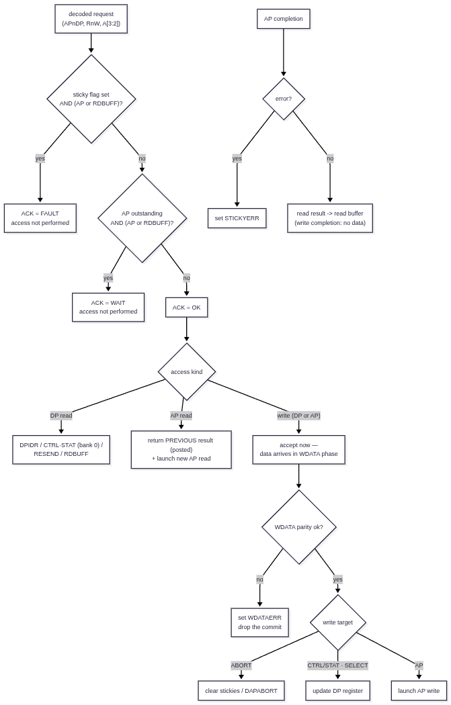
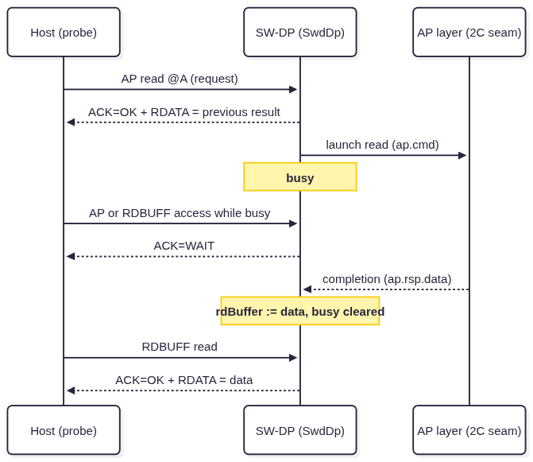
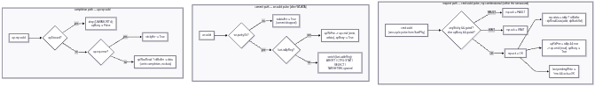

# Phase 2B — SW-DP Register File: Implementation & Verification

**Status:** implemented and sim-verified (Jul 2026)

**Tasks:**
- [x] Implement `DPIDR` register (DP read, A[3:2]=0b00) — read-only device ID with manufacturer, version, min/revision fields
- [x] Implement `CTRL/STAT` register (DP read/write, A[3:2]=0b01, SELECT.DPBANKSEL=0x0) — sticky error flags: STICKYERR, STICKYCMP, STICKYORUN, WDATAERR; power control: CDBGPWRUPREQ/ACK, CSYSPWRUPREQ/ACK; ORUNDETECT enable
- [x] Implement `SELECT` register (DP write, A[3:2]=0b10) — DPBANKSEL (4 bits) + ADDR (AP address selection)
- [x] Implement `RDBUFF` register (DP read, A[3:2]=0b11) — read buffer for previous AP read result
- [x] Implement `ABORT` register (DP write, A[3:2]=0b00) — DAPABORT, STKCMPCLR, STKERRCLR, WDERRCLR, ORUNERRCLR
- [x] Implement sticky error handling — FAULT response when any sticky flag is set; errors cleared only via ABORT register (Sec B1.2)
- [x] Implement WAIT response logic — issued when AP/DP access is outstanding or AP read result not yet available (Sec B4.2.3)
- [x] Consume `SwdDpWrite.parityOk` as WDATAERR sticky material (line-layer protocol error / line reset already handled in Phase 2A)

---

**Code Repository :**

Update submodules in [pythondata-cpu-vexriscv_smp](https://github.com/disdi/pythondata-cpu-vexriscv_smp) to below :

- SpinalHdl - https://github.com/disdi/SpinalHDL/tree/phase2b
- VexRiscv - https://github.com/disdi/VexRiscv/tree/phase2b


| Artifact | Path |
|---|---|
| RTL (`SwdDp`, `SwdPhyDp`, AP seam bundles) | `EXT/SpinalHDL/lib/src/main/scala/spinal/lib/cpu/riscv/debug/DebugTransportModuleSwd.scala` (same file as Phase 2A) |
| Shared probe driver | `EXT/VexRiscv/src/test/scala/vexriscv/SwdSimDriver.scala` |
| Testbench | `EXT/VexRiscv/src/test/scala/vexriscv/DebugSwdDpTest.scala` |
| Run | `cd EXT/VexRiscv && sbt -batch "testOnly vexriscv.DebugSwdDpTest"` (both phases: `"testOnly vexriscv.DebugSwdTest vexriscv.DebugSwdDpTest"`) |

`EXT` = `pythondata-cpu-vexriscv-smp/pythondata_cpu_vexriscv_smp/verilog/ext`. Still zero
LiteX involvement.

---

## 1. What is implemented

### 1.1 `SwdDp` — the ADI SW-DP register file

`SwdDp` sits behind the Phase 2A seam (`SwdDpCmd`/`SwdDpRsp`/`SwdDpWrite`, consumed as
slave flows) and exposes a **new AP seam** toward Phase 2C:

```text
ap.cmd : master Flow(SwdApCmd)   -- rnw, addr = A[3:2], apSel = SELECT[31:24], wdata
ap.rsp : slave  Flow(SwdApRsp)   -- error, data (completion; test-controlled latency)
```

`SwdPhyDp` assembles `SwdPhy` + `SwdDp` and is the step-1b DUT: SWD pins on one side,
AP seam on the other.

### 1.2 DP register map (SWD `A[3:2]` encoding)

| A[3:2] | Read | Write |
|---|---|---|
| `00` | **DPIDR** (parameter; default `0x0BA11AAB` placeholder) | **ABORT** — DAPABORT, STKCMPCLR, STKERRCLR, WDERRCLR, ORUNERRCLR |
| `01` | **CTRL/STAT** when `DPBANKSEL==0`; other banks read as zero | **CTRL/STAT** when `DPBANKSEL==0`; other banks write-ignored |
| `10` | **RESEND** (= last posted result) | **SELECT** — APSEL[31:24], APBANKSEL[7:4], DPBANKSEL[3:0] |
| `11` | **RDBUFF** (= last posted result) | TARGETSEL (SWD v2) — accepted, ignored |

CTRL/STAT implemented bits: ORUNDETECT[0] (stored only), STICKYORUN[1], STICKYCMP[4],
STICKYERR[5], WDATAERR[7], CDBGPWRUPREQ/ACK[28/29], CSYSPWRUPREQ/ACK[30/31] — the ACKs
mirror the REQs. All other bits read as zero.

The DPIDR default has a non-ARM DESIGNER field (`[11:1] = 0x555`, bit0 = 1, DPv1) — a
deliberate placeholder to be replaced per the Phase 2D identification rules before any
host-tool integration.

### 1.3 ACK policy (the WAIT/FAULT generation deferred from 2A)

Decided combinationally off the registered `cmd` pulse, so the answer lands within the
turnaround as the 2A contract requires:

| Condition | ACK | Scope |
|---|---|---|
| any sticky flag set | **FAULT** | AP accesses and RDBUFF reads only (ADIv5.2 §B4.2.4) — DPIDR/CTRL·STAT/SELECT/ABORT/RESEND keep answering OK so the host can diagnose and clear |
| AP transaction outstanding | **WAIT** | AP accesses and RDBUFF reads — DP accesses (e.g. CTRL/STAT polling) still OK |
| otherwise | **OK** | the access itself only happens on OK |

FAULT takes precedence over WAIT.

### 1.4 Posted AP reads, write commit, stickies

- **AP read** (ACK=OK): answered immediately from `rdBuffer` (posted semantics — the
  *previous* result), while the new access is launched on `ap.cmd`. Completion loads
  `rdBuffer`; `RDBUFF`/`RESEND` then return it without launching anything.
- **AP write** (ACK=OK): launched only at the WDATA **commit** (`SwdDpWrite` with
  `parityOk`), carrying the data. Busy until completion.
- **STICKYERR**: set by a completion with `error=1` (the completion's data is discarded).
- **WDATAERR**: set when the WDATA phase fails parity — the commit is dropped (DP register
  writes and AP writes alike). Not a line-level protocol error; no line reset needed.
- **DAPABORT**: clears busy and marks the in-flight completion to be discarded when it
  eventually arrives, so a stale response cannot corrupt `rdBuffer`.
- **DP writes** commit at the WDATA phase too: the DP remembers the last OK-acked write
  target (`last.pendingWrite`) from the request; WAIT/FAULT frames produce no commit
  (2A skips their data phase), so a gated write can never take effect.

### 1.5 Graphical model — spec intent vs RTL (side-by-side, as in Phase2A.md §1.4)

Phase 2B is not a per-frame FSM like `SwdPhy` — it is a register file plus an **access
decision** made once per request and a small amount of persistent state (stickies, busy,
read buffer, pending-write). The diagrams therefore show the decision/dataflow rather
than wire states.

#### 1.5.1 Abstract model (ADIv5.2 §B4.2 behavior)



The most 2B-specific behavior — the posted AP read — as a sequence:



#### 1.5.2 `SwdDp` RTL — the same flow in signals

**Source:** `spinal.lib.cpu.riscv.debug.SwdDp` (three concurrent paths: request,
WDATA commit, AP completion — no FSM, one decision per `cmd` pulse).



#### 1.5.3 Element inventory — abstract ↔ RTL

| Abstract (§1.5.1) | RTL construct | Notes |
|---|---|---|
| sticky flags | `stickyOrun/stickyCmp/stickyErr/wdataErr` regs | only `stickyErr`/`wdataErr` hardware-set (scope) |
| "AP outstanding" | `apBusy` reg | set at launch, cleared at completion / DAPABORT |
| read buffer | `rdBuffer` reg | serves AP-read RDATA, RDBUFF **and** RESEND |
| ACK decision | combinational mux off the `cmd` pulse | FAULT > WAIT > OK; lands within the turnaround |
| "access not performed" | launches/commits gated on `ack == OK` | `apRdFire`, `last.pendingWrite` |
| write accepted, data later | `last.pendingWrite/isApReg/addrReg` regs | the request↔commit link across the WDATA phase |
| AP write launch | `apWrFire` at `wr.valid` | carries `wr.data`; not at the request |
| completion → buffer | `apWasRead` gate | write completions can't clobber `rdBuffer` |
| DAPABORT | `apDiscard` flag | RTL-only: in-flight completion dropped safely |

#### 1.5.4 Side-by-side graph

```text
Abstract (ADIv5.2 B4.2)                        SwdDp RTL
───────────────────────                        ─────────
request ──sticky?(AP/RDBUFF)──► FAULT          cmd.valid ──anySticky && gated──► ack=FAULT
   │ no                                             │
   ├────busy?(AP/RDBUFF)──────► WAIT                ├──apBusy && gated──────────► ack=WAIT
   │ no                                             │
   ▼                                                ▼
  OK ──DP read──► DPIDR/CTRL·STAT/                ack=OK ── !apNdp && rnw ──► dpReadData mux
   │              RESEND/RDBUFF                     │
   ├──AP read──► previous result                    ├── apRdFire ──► rdata=rdBuffer,
   │             + launch new read                  │                ap.cmd, apBusy:=1
   │                                                │
   └──write───► ACK now, data later                 └── last.pendingWrite := True
                      │                                            │
             WDATA parity ok?                            wr.valid: parityOk?
              no  → WDATAERR, drop                        no  → wdataErr := True
              yes → ABORT / register /                    yes → ABORT/CTRL·STAT/SELECT
                    AP write launch                             or apWrFire ──► ap.cmd

completion ── error ──► STICKYERR              ap.rsp.valid ── error ──► stickyErr := 1
           └─ data  ──► read buffer                         └─ apWasRead ──► rdBuffer := data
                                               (apDiscard: DAPABORT'd completion dropped)
```

#### 1.5.5 Match / difference summary

| Aspect | Match? |
|---|---|
| ACK precedence FAULT > WAIT > OK | **Yes** |
| Sticky FAULT scoped to AP + RDBUFF; other DP accesses keep working | **Yes** (ADIv5.2 §B4.2.4) |
| Posted AP read: previous result now, new result to buffer | **Yes** — spec leaves first-read data implementation-defined; RTL returns `rdBuffer` |
| Write ACKed at request, committed after WDATA parity | **Yes** (`last.pendingWrite`) |
| WDATAERR on data-phase parity fail, commit dropped, no line reset needed | **Yes** |
| RESEND | **Alias of `rdBuffer`** — same value as RDBUFF, no relaunch |
| ORUNDETECT / STICKYORUN / STICKYCMP hardware behavior | **No** — stored/clearable only (deliberate scope) |
| Power-up REQ→ACK handshake | **Mirrored**, no power controller modeled |
| `apDiscard` (DAPABORT in-flight drop), `apWasRead` gate | **RTL-only** robustness details |

**One-sentence takeaway:** §1.5.1 is the ADI access contract; `SwdDp` implements it as one
combinational decision per request plus three concurrent signal paths (request / commit /
completion), with `last.*` bridging the ACK-before-data gap that defines SWD writes.

---

### 1.6 Scope limits (deliberate)

ORUNDETECT is stored but overrun detection is **not implemented** — STICKYORUN and
STICKYCMP are never set by hardware, only ABORT-clearable · CTRL/STAT banks other than 0
(DLCR etc.) are RAZ/WI · TARGETSEL is v2 and ignored · power-up ACKs mirror REQs rather
than modeling a power controller.

---

## 2. Testbench changes

### 2.1 Shared driver extraction

The probe-side bit-bang logic (`step`, `header`, `readAck`, `transactRead`,
`transactWrite`, `lineReset`, with all embedded protocol assertions) moved from the 1a
suite into **`SwdSimDriver.scala`** (`SwdHostDriver`, `SwdAckSim`). `DebugSwdTest`
delegates to it with its 9 test bodies unchanged — proven by the suites running together
(18/18). Step 2 will reuse the same driver against the full transport + `DebugModule`.

### 2.2 The stub moves back one layer

Exactly as the step-1b plan prescribes: the always-ready DP stub is **gone** — the real
`SwdDp` answers within the turnaround by construction (combinational response). The test
harness now stubs the **AP side**:

- an observer thread records every `ap.cmd` fire into a queue (`(rnw, addr, wdata)`);
- **`apComplete(data, error)`** delivers a completion on `ap.rsp` for exactly one SWCLK
  cycle — completions are test-controlled, which is what makes posted-read ordering and
  WAIT-while-busy directly testable (the AP simply *doesn't respond* until the test says so).

Sugar wrappers keep tests readable: `dpRead/dpWrite/apRead/apWrite` map to driver
transactions with `APnDP` set accordingly.

---

## 3. What each test verifies

| # | Test | Verifies |
|---|---|---|
| 1 | **DPIDR read returns the configured value** | The step-1b headline: a real DPIDR from the register file (no stub), bit-exact against the elaboration parameter. |
| 2 | **CTRL/STAT power-up requests mirror ACKs** | CTRL/STAT reads as 0 fresh; writing CDBGPWRUPREQ+CSYSPWRUPREQ (`0x50000000`) reads back `0xF0000000` — REQs stored, ACKs mirrored. Also proves the DP write path commits at the WDATA phase. |
| 3 | **SELECT DPBANKSEL banks CTRL/STAT** | With DPBANKSEL=1 the CTRL/STAT address reads as zero (unimplemented bank, still ACK=OK); switching back to bank 0 restores the real register. |
| 4 | **AP read is posted; RDBUFF returns the completed result** | ADI posted-read semantics end-to-end: first AP read returns the stale buffer while launching the access; RDBUFF returns the completion; a second AP read returns the *previous* result while posting the next. |
| 5 | **WAIT while an AP access is outstanding; DP accesses stay OK** | WAIT generation (deferred from 2A): AP read and RDBUFF get WAIT while busy; CTRL/STAT polling still answers OK — the exact behavior a host retry loop relies on. |
| 6 | **AP completion error sets STICKYERR; FAULT until ABORT clears** | The sticky-error contract: FAULT on AP + RDBUFF, DPIDR/CTRL·STAT unaffected, STICKYERR visible in CTRL/STAT, cleared **only** via ABORT.STKERRCLR, then normal operation resumes. |
| 7 | **Write data parity error sets WDATAERR and drops the commit** | A DP write with corrupted WDATA parity is ACKed OK (ACK precedes data) but never commits — the power bits stay clear while WDATAERR sets; FAULT gating applies; ABORT.WDERRCLR clears. |
| 8 | **AP write commits after the data phase and holds busy** | The AP write launches only at the WDATA commit with bit-exact data, holds WAIT for subsequent AP accesses until completion, and the write completion does **not** clobber `rdBuffer`. |
| 9 | **RESEND returns the same value as RDBUFF** | The DP-read `A[3:2]=10` decode: both RESEND and RDBUFF return the posted result without launching a new AP access. |

Everything from Phase 2A (turnaround positions, LSB-first, parity, line reset,
protocol-error silence) is still enforced on every transaction by the shared driver's
embedded assertions — now exercised against the real DP.

---

## 4. Verification

```sh
cd ~/fpga/pythondata-cpu-vexriscv-smp/pythondata_cpu_vexriscv_smp/verilog/ext/VexRiscv
sbt -batch "testOnly vexriscv.DebugSwdTest vexriscv.DebugSwdDpTest"
# expect: Tests: succeeded 18, failed 0, canceled 0, ignored 0, pending 0
```