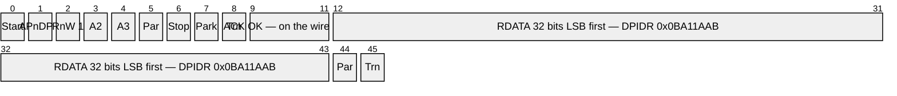
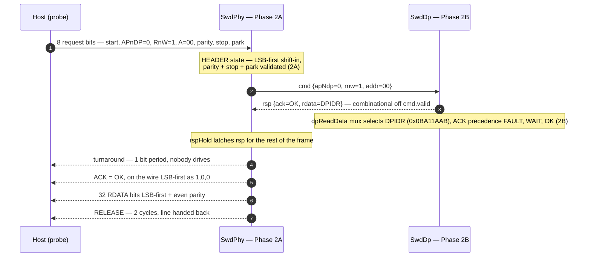
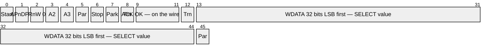
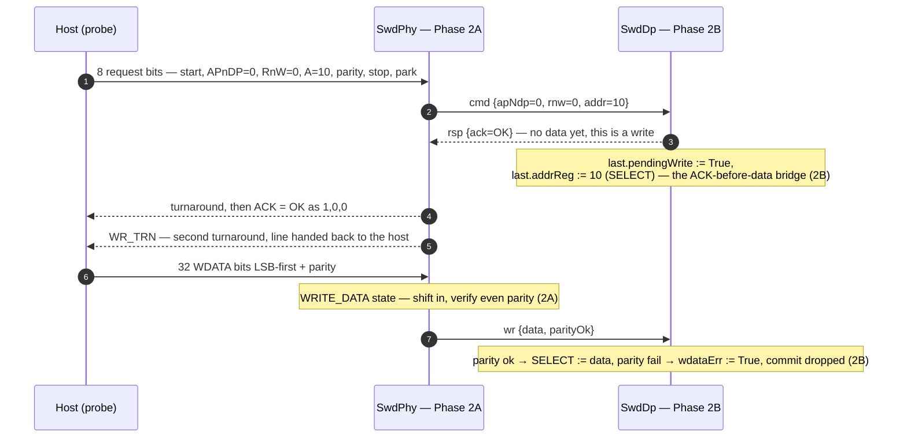

# Phase 2B — SW-DP Register File: Implementation & Verification

**Status:** implemented and sim-verified (Jul 2026)

**Tasks:**
- [x] Implement `DPIDR` register (DP read, A[3:2]=0b00) — read-only device ID with manufacturer, version, min/revision fields
- [x] Implement `CTRL/STAT` register (DP read/write, A[3:2]=0b01, SELECT.DPBANKSEL=0x0) — sticky error flags: STICKYERR, STICKYCMP, STICKYORUN, WDATAERR; power control: CDBGPWRUPREQ/ACK, CSYSPWRUPREQ/ACK; ORUNDETECT enable
- [x] Implement `SELECT` register (DP write, A[3:2]=0b10) — DPBANKSEL (4 bits) + ADDR (AP address selection)
- [x] Implement `RDBUFF` register (DP read, A[3:2]=0b11) — read buffer for previous AP read result
- [x] Implement `ABORT` register (DP write, A[3:2]=0b00) — DAPABORT, STKCMPCLR, STKERRCLR, WDERRCLR, ORUNERRCLR
- [x] Implement sticky error handling — FAULT response when any sticky flag is set; errors cleared only via ABORT register (Sec B1.2)
- [x] Implement WAIT response logic — issued when AP/DP access is outstanding or AP read result not yet available (Sec B4.2.3)
- [x] Consume `SwdDpWrite.parityOk` as WDATAERR sticky material (line-layer protocol error / line reset already handled in Phase 2A)

---

**Code Repository :**

Update submodules in [pythondata-cpu-vexriscv_smp](https://github.com/disdi/pythondata-cpu-vexriscv_smp) to below :

- SpinalHdl - https://github.com/disdi/SpinalHDL/tree/phase2b
- VexRiscv - https://github.com/disdi/VexRiscv/tree/phase2b


| Artifact | Path |
|---|---|
| RTL (`SwdDp`, `SwdPhyDp`, AP seam bundles) | `EXT/SpinalHDL/lib/src/main/scala/spinal/lib/cpu/riscv/debug/DebugTransportModuleSwd.scala` (same file as Phase 2A) |
| Shared probe driver | `EXT/VexRiscv/src/test/scala/vexriscv/SwdSimDriver.scala` |
| Testbench | `EXT/VexRiscv/src/test/scala/vexriscv/DebugSwdDpTest.scala` |
| Run | `cd EXT/VexRiscv && sbt -batch "testOnly vexriscv.DebugSwdDpTest"` (both phases: `"testOnly vexriscv.DebugSwdTest vexriscv.DebugSwdDpTest"`) |

`EXT` = `pythondata-cpu-vexriscv-smp/pythondata_cpu_vexriscv_smp/verilog/ext`. Still zero
LiteX involvement.

---

## 1. What is implemented

### 1.1 `SwdDp` — the ADI SW-DP register file

`SwdDp` sits behind the Phase 2A seam (`SwdDpCmd`/`SwdDpRsp`/`SwdDpWrite`, consumed as
slave flows) and exposes a **new AP seam** toward Phase 2C:

```text
ap.cmd : master Flow(SwdApCmd)   -- rnw, addr = A[3:2], apSel = SELECT[31:24], wdata
ap.rsp : slave  Flow(SwdApRsp)   -- error, data (completion; test-controlled latency)
```


### 1.2 DP register map (SWD `A[3:2]` encoding)

| A[3:2] | Read | Write |
|---|---|---|
| `00` | **DPIDR** (parameter; default `0x0BA11AAB` placeholder) | **ABORT** — DAPABORT, STKCMPCLR, STKERRCLR, WDERRCLR, ORUNERRCLR |
| `01` | **CTRL/STAT** when `DPBANKSEL==0`; other banks read as zero | **CTRL/STAT** when `DPBANKSEL==0`; other banks write-ignored |
| `10` | **RESEND** (= last posted result) | **SELECT** — APSEL[31:24], APBANKSEL[7:4], DPBANKSEL[3:0] |
| `11` | **RDBUFF** (= last posted result) | TARGETSEL (SWD v2) — accepted, ignored |

These two diagrams put it back on the
wire, making explicit **where each step of a DP access is accomplished**: the frame shape is
Phase 2A (`SwdPhy`), the register semantics are Phase 2B (`SwdDp`). Neither phase performs a
DP access on its own.

**A DP read** — DPIDR, `A[3:2] = 00`

*Wire layout* — one cell per SWCLK bit period, LSB first within every multi-bit field:



Bits 0–7 host-driven · bits 9–44 target-driven · bits 8 and 45 are turnarounds where
neither side drives and SWDIO floats to its mandatory pull-up. The closing turnaround is
one **bit period** on the wire but two SWCLK cycles in RTL (`RELEASE`), because `SwdPhy`
registers its outputs — see the step-ownership table below.

*Phase ownership*:



**A DP write** — SELECT, `A[3:2] = 10`

*Wire layout* — note the second turnaround at bit 12, absent from the read:



Bits 0–7 host-driven · bits 9–11 target-driven · bits 13–45 host-driven again · bits 8
and 12 are turnarounds. **This layout is the reason the 2A↔2B seam has three flows**: the
target must commit to the ACK at bits 9–11, thirty-two bit periods before the data it is
acknowledging exists on the wire.

*Phase ownership*:




---

## 2. Testbench changes

### 2.1 Shared driver extraction

The probe-side bit-bang logic (`step`, `header`, `readAck`, `transactRead`,
`transactWrite`, `lineReset`, with all embedded protocol assertions) moved from the 1a
suite into **`SwdSimDriver.scala`** (`SwdHostDriver`, `SwdAckSim`). `DebugSwdTest`
delegates to it with its 9 test bodies unchanged — proven by the suites running together
(18/18). Step 2 will reuse the same driver against the full transport + `DebugModule`.

### 2.2 The stub moves back one layer

Exactly as the step-1b plan prescribes: the always-ready DP stub is **gone** — the real
`SwdDp` answers within the turnaround by construction (combinational response). The test
harness now stubs the **AP side**:

- an observer thread records every `ap.cmd` fire into a queue (`(rnw, addr, wdata)`);
- **`apComplete(data, error)`** delivers a completion on `ap.rsp` for exactly one SWCLK
  cycle — completions are test-controlled, which is what makes posted-read ordering and
  WAIT-while-busy directly testable (the AP simply *doesn't respond* until the test says so).

Sugar wrappers keep tests readable: `dpRead/dpWrite/apRead/apWrite` map to driver
transactions with `APnDP` set accordingly.


---

## 4. Verification

```sh
cd ~/fpga/pythondata-cpu-vexriscv-smp/pythondata_cpu_vexriscv_smp/verilog/ext/VexRiscv
sbt -batch "testOnly vexriscv.DebugSwdTest vexriscv.DebugSwdDpTest"
# expect: Tests: succeeded 18, failed 0, canceled 0, ignored 0, pending 0
```