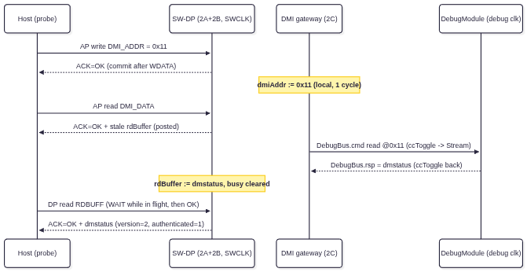

# Phase 2C — DMI Gateway, Clock Crossing & DebugModule Integration

**Status:** implemented and sim-verified.

**Tasks:**
- [x] Map AP read/write operations to `DebugBus.cmd` (same `DebugCmd` interface used by JTAG DTM)
- [x] Implement AP address decoding — translate `SELECT.ADDR` + `A[3:2]` to DMI address for `DebugBus.cmd.address`
- [x] Implement posted AP reads — first AP read returns UNKNOWN data; result available on next AP read or RDBUFF read (Sec B4.2.2)
- [x] Wire `DebugBus.rsp` to RDATA output and ACK generation
- [x] Handle cross-clock-domain between SWD clock (SWCLK) and debug clock domain (reuse `ccToggle` pattern from JTAG DTM)
- [x] Implement WAIT response when `DebugBus.cmd` is not ready (DM busy)
- [x] Implement FAULT response when `DebugBus.rsp.error` is set

---

**Code Repository :**
- pythondata-cpu-vexriscv_smp - https://github.com/disdi/pythondata-cpu-vexriscv_smp/tree/phase2c

OR

Update submodules in [pythondata-cpu-vexriscv_smp](https://github.com/disdi/pythondata-cpu-vexriscv_smp) to below :

- SpinalHdl - https://github.com/disdi/SpinalHDL/tree/phase2c
- VexRiscv - https://github.com/disdi/VexRiscv/tree/phase2c

| Artifact | Path |
|---|---|
| RTL (`SwdDmiGateway`, `DebugTransportModuleSwd`) | `EXT/SpinalHDL/lib/src/main/scala/spinal/lib/cpu/riscv/debug/DebugTransportModuleSwd.scala` (same file as 2A/2B) |
| Fiber hook (`withSwdTransport()`) | `EXT/SpinalHDL/lib/src/main/scala/spinal/lib/cpu/riscv/debug/DebugModuleFiber.scala` |
| Testbench (incl. `SwdDmTestTop`) | `EXT/VexRiscv/src/test/scala/vexriscv/DebugSwdDmTest.scala` |
| Run | `cd EXT/VexRiscv && sbt -batch "testOnly vexriscv.DebugSwdDmTest"` (all: `"testOnly vexriscv.DebugSwdTest vexriscv.DebugSwdDpTest vexriscv.DebugSwdDmTest"`) |

`EXT` = `pythondata-cpu-vexriscv-smp/pythondata_cpu_vexriscv_smp/verilog/ext`. Still zero LiteX involvement.

---

## 1. What is implemented

### 1.1 `SwdDmiGateway` — the RISC-V DMI gateway AP

Sits behind the 2B AP seam (`SwdApCmd`/`SwdApRsp`) and drives a `DebugBus` master —
the **same `DebugCmd`/`DebugRsp` interface the JTAG DTM produces**, which is the whole
point of the transport-agnostic design. 

| AP `A[3:2]` | Register | Access | Behavior |
|---|---|---|---|
| `00` | `AP_IDR` | RO | identification constant (default `0x74726976` "triv") — completes locally in 1 SWCLK cycle |
| `01` | `DMI_ADDR` | RW | latches the 7-bit DMI word address; readable back — local |
| `10` | `DMI_DATA` | RW | performs the `DebugBus` transaction at `DMI_ADDR` (RnW from the SWD packet) — crosses domains |
| `11` | `POSTED_READ` | RO | last completed DMI **read** result (RDBUFF semantics) — local |

Writes to RO registers complete OK with no effect. `SELECT.APSEL` is not decoded
(single-AP design). AP reads launch at the request (posted, per 2B); AP writes launch at
the WDATA commit carrying the data.

### 1.2 Clock crossing — the JTAG DTM pattern, reused

The gateway is an `Area` with the same two-domain shape as `DebugTransportModuleJtag`:

- **cmd** (SWCLK → debug): `dmiCmd.ccToggle(...).toStream.m2sPipe(crossClockData = true,
  holdPayload = true)` → `bus.cmd`. Stream backpressure from a busy DM simply extends the
  in-flight window — the DP's WAIT logic (2B) covers it.
- **rsp** (debug → SWCLK): `bus.rsp.ccToggle(..., withOutputBufferedReset = false)` — the
  flag matters: the SWCLK domain is **BOOT-reset** (a 2-wire interface has no reset pin;
  line reset is the protocol-level reset), and a buffered reset cannot be synthesized into
  a BOOT domain (SpinalHDL asserts). Pop-side synchronizers boot-init instead.
- **Solicited-completion gating** (`dmiPending` here, `apBusy` in 2B): only a response to
  an in-flight access completes anything. 

The DM responds on `DebugBus.rsp` for **both** reads and writes (`DebugBusSlaveFactory`
stages every `cmd.fire`), so AP writes complete on the crossed response — no
self-acknowledgment needed.

### 1.3 `DebugTransportModuleSwd` — the full transport

SWD pins → `SwdPhy` (2A) → `SwdDp` (2B) → `SwdDmiGateway` (2C) → `DebugBus`. The SWD side
elaborates under `ClockDomain(swclk, resetKind = BOOT)`; the `DebugBus` side under the
provided `debugCd`. This is the SWD counterpart of `DebugTransportModuleJtagTap`.

`DebugModuleFiber.withSwdTransport(dpidr, apIdr)` instantiates it alongside
`withJtagTap()` — same one-transport-per-build rule (direct `io.ctrl` connection, no
arbitration).

### 1.4 End-to-end dmstatus read (the step-2 exit), graphically



---

## 2. Testbench — `DebugSwdDmTest`

- **DUT = `SwdDmTestTop`**: the full transport + a real `DebugModule` (version 2, 1 hart,
  `progBufSize=2`, `datacount=1`) with a **stubbed `DebugHartBus`** — running, never
  halted, `hartToDm`/`resume.rsp` idle.
- **Two genuinely asynchronous clocks**: the shared `SwdHostDriver` bit-bangs SWCLK
  (bench-owned, via a `ClockDomain` handle over the pin) while `dut.clockDomain`
  free-runs via `forkStimulus` — DMI completion latency is variable by construction.
- **Host-style retry helpers**: `apWriteRetry`/`apReadRetry`/`rdbuff` retry on WAIT with
  bounded attempts — the same loop a real OpenOCD target would run. `dmiRead`/`dmiWrite`
  compose them into DMI operations.
- **Failure forensics built in**: on any unexpected ACK the harness reads CTRL/STAT and
  includes the sticky flags in the assertion message (`ackCheck`) — this is what cracked
  the phantom-completion bug (§4.2). The `sim(name, seed = …)` hook pins a failing seed
  for deterministic reproduction.

## 3. What each test verifies

| # | Test | Verifies |
|---|---|---|
| 1 | **DPIDR reads through the assembled transport** | The full stack elaborates and runs: BOOT-domain phy, async clocks, fiber-style wiring — and the plain DP path still works. |
| 2 | **AP IDR via posted read** | Gateway local completion path + 2B posted-read plumbing end-to-end (`AP_IDR` lands in RDBUFF). |
| 3 | **DMI_ADDR write and readback** | The address latch: AP write commits (WDATA path through the gateway), AP read returns it. |
| 4 | **dmstatus read over SWD — step 2 exit criterion** | The headline: `DMI_ADDR←0x11`, `DMI_DATA` read crosses to the DM and back; RDBUFF poll returns dmstatus with `version=2` and `authenticated=1`. |
| 5 | **dmcontrol dmactive write and readback** | Full DMI **write** path into a real DM register (resets 0, reads back 1) — write launch at commit, crossed completion, subsequent read. |
| 6 | **abstractauto write and readback** | A second, WARL-masked DM register round-trip (`0x18`, bits [0]/[17:16]) including clearing. (data0/progbuf cannot round-trip with a stubbed hart — see §4.3.) |
| 7 | **POSTED_READ returns the last DMI read result** | The gateway's `lastRead` alias agrees with RDBUFF after a completed DMI read. |

WAIT responses are exercised implicitly on nearly every test by the retry helpers (the
async completion latency makes WAIT occur naturally); FAULT-on-`rsp.error` was unit-tested
in the 1b suite (the real DM's factory never raises `error`).


---

## 4. Verification

```sh
cd ~/fpga/pythondata-cpu-vexriscv-smp/pythondata_cpu_vexriscv_smp/verilog/ext/VexRiscv
sbt -batch "testOnly vexriscv.DebugSwdDmTest"
# expect: Tests: succeeded 7, failed 0, canceled 0, ignored 0, pending 0
sbt -batch "testOnly vexriscv.DebugSwdTest vexriscv.DebugSwdDpTest vexriscv.DebugSwdDmTest"
# expect: Tests: succeeded 25, failed 0, canceled 0, ignored 0, pending 0
```

## 5. Summary

Phases 2A–2C complete the **target-side RTL** of the SWD plan; the DebugBus now speaks SWD end-to-end in simulation. 
