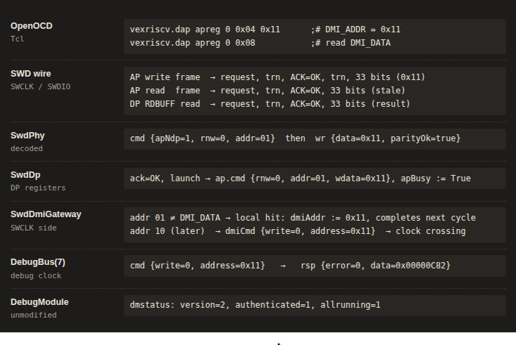

# System Integration — SWD


Goal is **host-visible integration only** (LiteX SoC, OpenOCD, GDB). Target-side SWD
RTL (`SwdPhy` / `SwdDp` / `SwdDmiGateway`) is Phase **2A–2C** and is not re-defined here.

---

**Code repositories**

| Piece | Where | Status |
| --- | --- | --- |
| SWD DTM (`DebugTransportModuleSwd`) + `DebugModuleFiber.withSwdTransport()` | SpinalHDL [#1956](https://github.com/SpinalHDL/SpinalHDL/pull/1956) | merged 2026-09-08 |
| `spinal.lib.com.swd` split (`Swd` / `SwdPhy` / `SwdDp`) | SpinalHDL [#1966](https://github.com/SpinalHDL/SpinalHDL/pull/1966) | merged 2026-09-19 |
| VexRiscv SMP cluster `--swd` | VexRiscv [#483](https://github.com/SpinalHDL/VexRiscv/pull/483), [#499](https://github.com/SpinalHDL/VexRiscv/pull/499) | merged 2026-09-08 / 09-19 |
| **VexiiRiscv** LiteX SoC `--with-swd` + MicroSoc `--swd` | VexiiRiscv [#184](https://github.com/SpinalHDL/VexiiRiscv/pull/184) | merged 2026-09-23 |
| JTAG on Xilinx USER chains (`add_cpu_jtag_debug`, `--with-cpu-jtag-debug`) | LiteX [#2572](https://github.com/enjoy-digital/litex/pull/2572) + linux-on-litex-vexriscv [#459](https://github.com/litex-hub/linux-on-litex-vexriscv/pull/459) | merged 2026-09-10 |
| LiteX: `swdremote` sim module, OpenOCD configs, `--with-swd-debug` for `vexriscv_smp` | <https://github.com/disdi/litex/tree/swd> | branch, not yet proposed upstream |
| linux-on-litex-vexriscv: SWD pads on Arty Pmod JB | <https://github.com/disdi/linux-on-litex-vexriscv/tree/swd-arty> | branch, waits for the LiteX part |
| OpenOCD (Vexriscv fork) | <https://github.com/disdi/openocd/tree/vexriscv-gateway> | branch; Gerrit [9786](https://review.openocd.org/c/openocd/+/9786) + gateway backend |


**OpenOCD (host ONLY)** — :

| Lane | Build | Role |
| --- | --- | --- |
| raw-AP smoke | OpenOCD **master** (stock OK for SWD `remote_bitbang`) | DPIDR + `dap apreg` → `dmstatus`; **no** GDB |
| **Vexriscv fork** (`riscv` + GDB) | [disdi/openocd `vexriscv-gateway`](https://github.com/disdi/openocd/tree/vexriscv-gateway) — OpenOCD **master** + [Gerrit 9786](https://review.openocd.org/c/openocd/+/9786) + designer-AP / VexRiscv DTM backend | examine + halt/resume/regs + GDB :3333 |

Stock master is enough for smoke. Full `riscv` attach needs the published
[`vexriscv-gateway`](https://github.com/disdi/openocd/tree/vexriscv-gateway) branch:
9786 (DTM + Mem-AP DMI backend), two fixes to 9786 itself, and a second **designer-AP /
VexRiscv gateway** backend for the Phase 2C `DMI_ADDR` / `DMI_DATA` map. No RTL change.

Upstream’s stock `riscv` target **rejects `-dap`** at argument parsing, so Tcl-only
`dap apreg` helpers cannot drive a GDB session — that is why the 9786 + gateway path exists.

---

## Simulation based workflow using verilator

### Side-by-side

| Terminal | JTAG — **full three-terminal ✅** | SWD — **full three-terminal ✅** |
| --- | --- | --- |
| **1 — sim** | `litex_sim … --with-privileged-debug --jtag-tap --with-jtagremote` → TCP **44853** (`jtagremote`) | `litex_sim … --with-privileged-debug --with-swd-debug --with-swdremote` → TCP **44854** (`swdremote`); add `--ram-init=demo.bin` for demo debug |
| **2 — OpenOCD** | Stock `riscv` target + **fabric** TAP — no vendor BSCAN in sim; examines hart; GDB **:3333** | `transport select swd` + DAP + **Vexriscv fork** `riscv`; examines hart; GDB **:3333** |
| **3 — GDB** | `target extended-remote localhost:3333` → halt / regs / `load` | attach + regs ✅; demo **`break main` / `continue` / `bt`** ✅ via **preload** (no GDB `load`) |

| Capability | JTAG | SWD |
| --- | --- | --- |
| Verilator SoC + official DM | ✅ | ✅ (`_Swd` cluster) |
| Wire transport in sim | ✅ JTAG TAP + tunnel | ✅ SW-DP (`DebugTransportModuleSwd`) |
| OpenOCD sees transport | ✅ TAP `0x10003fff` | ✅ SWD DPIDR `0x0ba11aab` |
| Read `dmstatus` | ✅ via `riscv` / DMI | ✅ via `vexriscv_dmi_read 0x11` / smoke |
| `Examined RISC-V core` | ✅ | ✅ `XLEN=32, misa=0x40141101` |
| GDB halt / resume / `info registers` | ✅ | ✅ |
| Break / continue / backtrace | ✅ (`load` OK on JTAG) | ✅ via `--ram-init=demo.bin` + symbols; GDB `load` impractical in sim |
| OpenOCD binary | stock master | stock master for raw-AP smoke; **Vexriscv fork** ([disdi/openocd `vexriscv-gateway`](https://github.com/disdi/openocd/tree/vexriscv-gateway)) for `riscv` / GDB |

---

### JTAG — end-to-end workflow

Official stack only (`--with-privileged-debug` + full JTAG TAP in sim).

**Prerequisites**

- `litex_sim` (LiteX venv)
- OpenOCD master with standard RISC-V target
- `riscv64-unknown-elf-gdb`

**Configs**

| File | Role |
| --- | --- |
| `openocd_jtag_remote.cfg` | `remote_bitbang` → `localhost:44853` |
| `riscv_jtag_tunneled.tcl` | TAP `irlen 6`, ID `0x10003fff`, `riscv use_bscan_tunnel 6 1` |

**Terminal 1 — sim (keep running)**

```sh
litex_sim \
  --integrated-main-ram-size=0x10000 \
  --cpu-type=vexriscv_smp \
  --cpu-variant=linux \
  --cpu-count=1 \
  --with-privileged-debug \
  --jtag-tap \
  --with-jtagremote \
  --non-interactive
```

| Flag | Role |
| --- | --- |
| `--integrated-main-ram-size=0x10000` | 64 KiB main RAM for sim (demo load region) |
| `--cpu-type=vexriscv_smp` / `--cpu-variant=linux` / `--cpu-count=1` | SMP Linux-capable cluster, 1 hart |
| `--with-privileged-debug` | Official `DebugModule` + DTM (`_Pd` netlist token) |
| `--jtag-tap` | Full JTAG TAP on cluster (`_JtagT`); needed so sim has TCK/TMS/TDI/TDO pads |
| `--with-jtagremote` | LiteX sim module `jtagremote` — OpenOCD `remote_bitbang` on TCP **44853** |
| `--non-interactive` | Keep sim running (no local control menu); target for OpenOCD/GDB |

Wait for `Found port 44853` and BIOS prompt `litex>`. First run may take several minutes
(cluster regen + Verilator compile).

**Terminal 2 — OpenOCD (after Terminal 1 is up)**

```sh
openocd -f openocd_jtag_remote.cfg -f riscv_jtag_tunneled.tcl
```

Success indicators:

```text
Info : JTAG tap: riscv.cpu tap/device found: 0x10003fff
Info : Examined RISC-V core; found 1 harts
Ready for Remote Connections
Info : Listening on port 3333 for gdb connections
```

**Terminal 3 — GDB (after OpenOCD is ready)**

```sh
riscv64-unknown-elf-gdb demo/demo.elf
```

```gdb
set remotetimeout 120
set pagination off
set arch riscv:rv32
target extended-remote localhost:3333
monitor reset halt
x/8i $pc
info registers
```

One-liner:

```sh
riscv64-unknown-elf-gdb -ex "set remotetimeout 120" \
  -ex "target extended-remote localhost:3333" \
  demo/demo.elf
```

Load `demo.elf` (linked at `0x40000000`) only after halt — this `litex_sim` invocation does
**not** pass `--ram-init=demo.bin`, so the image is not preloaded:

```gdb
monitor reset halt
load demo/demo.elf
break main
continue
```

If sim is slow and `keep_alive()` warnings (slow bitbang) are seen, prefer `target extended-remote`
and `set remotetimeout 120`.

---

### SWD — OpenOCD

| Lane | OpenOCD build | Configs | Gives you |
| --- | --- | --- | --- |
| raw AP | master | `openocd_swd_remote.cfg` + `vexriscv_swd.cfg` | DPIDR + `dap apreg` → `dmstatus`; **no** GDB |
| `riscv` **Vexriscv fork** | [disdi/openocd `vexriscv-gateway`](https://github.com/disdi/openocd/tree/vexriscv-gateway) (master + 9786 + gateway) | + `vexriscv_swd_riscv_master.cfg` | examine + halt/resume/regs + GDB :3333 |

**Prerequisites (SWD-specific)**

- `litex_sim`
- OpenOCD **master** with SWD `remote_bitbang` for smoke test
- For `riscv` / GDB: build from
  [https://github.com/disdi/openocd/tree/vexriscv-gateway](https://github.com/disdi/openocd/tree/vexriscv-gateway)
  (stock master rejects `riscv -dap`)
- `riscv64-unknown-elf-gdb`; use **`set remotetimeout 300`** on the SWD lane

**Configs**

| File | Role |
| --- | --- |
| `openocd_swd_remote.cfg` | `remote_bitbang` → `localhost:44854`, `transport select swd` |
| `vexriscv_swd.cfg` | SW-DP + DAP + `vexriscv_dmi_read/write` + `vexriscv_swd_smoke` — **no** `riscv` target |
| `vexriscv_swd_riscv_master.cfg` | Vexriscv fork: `dtm create -type vexriscv-gateway` + `riscv` + `gdb-attach halt` |

**SWD Reading dmstatus, all the way down**



**Terminal 1 — sim (keep running)**

| Goal | Extra flag |
| --- | --- |
| Attach / regs / raw-AP smoke | (none) — wait for `Found port 44854` + BIOS `litex>` |
| Debug the demo app (`break main` / `continue` / `bt`) | `--ram-init=demo.bin` — wait for serialboot timeout → `Executing booted program at 0x40000000` → `litex-demo-app>` |

```sh
litex_sim \
  --integrated-main-ram-size=0x10000 \
  --cpu-type=vexriscv_smp \
  --cpu-variant=linux \
  --cpu-count=1 \
  --with-privileged-debug \
  --with-swd-debug \
  --with-swdremote \
  --non-interactive
  --ram-init=demo.bin
```

| Flag | Role |
| --- | --- |
| `--with-privileged-debug` | Official `DebugModule` (required; SWD is official-stack only) |
| `--with-swd-debug` | Cluster SWD transport + `_Swd` netlist token |
| `--with-swdremote` | LiteX sim module `swdremote` — OpenOCD SWD bitbang on TCP **44854** |
| `--ram-init=demo.bin` | Preload demo into `main_ram` @ `0x40000000` (demo-debug only) |

**Terminal 2 — raw-AP smoke** (stock master; no GDB)

One-shot:

```sh
openocd -s tcl \
  -f openocd_swd_remote.cfg \
  -f vexriscv_swd.cfg \
  -c init -c vexriscv_swd_smoke -c shutdown
```

Verified success:

```text
Info : SWD DPIDR 0x0ba11aab
AP_IDR   = 0x74726976
dmstatus = 0x004c0c82 (version=2 authenticated=1 allrunning=1 allhalted=0)
PASS: SWD -> SW-DP -> DMI gateway -> DebugModule
```

Interactive Tcl helpers (same two configs, stay open):

```tcl
vexriscv_swd_smoke
vexriscv_dmi_read 0x11          ;# dmstatus
```

**Terminal 2 — `riscv` target + GDB server** (Vexriscv fork: [disdi/openocd `vexriscv-gateway`](https://github.com/disdi/openocd/tree/vexriscv-gateway))

```sh
# Use the openocd binary built from:
#   https://github.com/disdi/openocd/tree/vexriscv-gateway
openocd -s tcl \
  -f openocd_swd_remote.cfg \
  -f vexriscv_swd.cfg \
  -f vexriscv_swd_riscv_master.cfg
```

Verified examine (real hart, not stub):

```text
Info : SWD DPIDR 0x0ba11aab
Info : [vexriscv.rv] datacount=1 progbufsize=2
Info : [vexriscv.rv] Examined RISC-V core
Info : [vexriscv.rv]  XLEN=32, misa=0x40141101
vexriscv.rv halted due to debug-request.
```

`misa=0x40141101` = RV32 I+M+A+S+U. Check halt/resume by `curstate`, not only by log
lines: `resume` may print `halted due to single-step.` while stepping off a
breakpoint — that is **not** a failure.

**Terminal 3 — GDB** (after the Vexriscv fork is listening on :3333)

Start GDB with the ELF for **symbols** (attach-only or demo-debug):

```sh
riscv64-unknown-elf-gdb demo/demo.elf
```

#### Attach and inspect

```gdb
set remotetimeout 300
set pagination off
set arch riscv:rv32
target extended-remote localhost:3333
info registers
x/6i $pc
```

`vexriscv_swd_riscv_master.cfg` sets `-event gdb-attach halt`, so GDB attaches to an
**already-halted** target — no `monitor halt` is required.

#### Debug the demo app (`break` / `continue` / `bt`)

If litex_sim is passed with **`--ram-init=demo.bin`** :

```gdb
set remotetimeout 300
set pagination off
set arch riscv:rv32
target extended-remote localhost:3333
# Image is already in main_ram via --ram-init=demo.bin.

x/8xw 0x40000000        # confirm preload (e.g. 0x0b00006f 0x00000013 ...)
set $pc = 0x40000000    # re-enter demo at _start so main is hit cleanly
break main
continue
bt
```

Expected: stop at `main` (typically around `0x4000069c`); `bt` shows `#0  main ()`.

---

## Hardware based workflow using Arty

Reference manual: <https://digilent.com/reference/programmable-logic/arty-a7/reference-manual>


| | |
| --- | --- |
| Device | `xc7a35ticsg324-1L` (`a7-35` variant) |
| System clock | `clk100`, 100 MHz |
| USB | On-board FTDI FT2232HQ — **USB-JTAG (programming) + USB-UART (console)** on one cable |
| Programmer | OpenOCD via `openocd_xc7_ft2232.cfg` + `bscan_spi_xc7a35t.bit` |
| PMOD connectors | JA/JB/JC/JD → `pmoda`/`pmodb`/`pmodc`/`pmodd` |
| SWD probe | External CMSIS-DAP (MCU-Link) on **Pmod JB** — not the on-board FTDI |


### JTAG on Arty — end-to-end workflow

Official stack only (`--with-privileged-debug`).

`--with-privileged-debug` alone is **not enough** on hardware. Without `--jtag-tap` the DTM is
tunneled, and its `debugPort_*` signals need a vendor boundary-scan primitive (`BSCANE2` on a
Xilinx USER chain). That binding is now upstream as an explicit second flag,
**`--with-cpu-jtag-debug`** — LiteX [#2572](https://github.com/enjoy-digital/litex/pull/2572)
(`LiteXSoC.add_cpu_jtag_debug()`, default USER4, IR `0x23`) and linux-on-litex-vexriscv
[#459](https://github.com/litex-hub/linux-on-litex-vexriscv/pull/459). USER1 stays free for
`jtagbone`. It replaces the original
[#458](https://github.com/litex-hub/linux-on-litex-vexriscv/pull/458), which was closed unmerged;
the hardware results below were taken with #458's `BSCANE2` instance, the same USER4 / IR `0x23`
binding.

**Prerequisites**

- Arty
- OpenOCD master with standard RISC-V target
- `riscv64-unknown-elf-gdb`

**Configs**

| File | Role |
| --- | --- |
| `openocd_arty_bscan.cfg` | Fits on-board FT2232 into the Xilinx TAP |
| `openocd_arty_official.cfg` | JTAG on Arty hardware. Composes `openocd_arty_bscan.cfg` (adapter + Xilinx TAP) with `riscv_jtag_tunneled.tcl` (the `riscv` target + `use_bscan_tunnel`). |


Terminal 1 — Build and Flash on Arty

```bash
# Stock LiteX + linux-on-litex-vexriscv master (litex#2572 / linux-on-litex-vexriscv#459)
./make.py --board=arty --cpu-count=1 --with-privileged-debug --with-cpu-jtag-debug --build --load
```

Expected in OpenOCD: `Examined RISC-V core; found 1 harts` and `XLEN=32, misa=0x40141101`.

Terminal 2 — OpenOCD (after Terminal 1 is up)

```bash
openocd -f litex/litex/tools/debug/openocd_arty_official.cfg
```

Terminal 3 — GDB (after OpenOCD is ready)


```bash
riscv64-unknown-elf-gdb -ex "set arch riscv:rv32"   -ex "target extended-remote localhost:3333"   linux-on-litex-vexriscv/build/arty/software/bios/bios.elf
```

---

### SWD on Arty — end-to-end workflow

Official stack only (`--with-swd-debug`; that flag implies `--with-privileged-debug`).
One transport per bitstream — do not combine with `--jtag-tap`.

`--with-swd-debug` alone is **not enough** on hardware. Unlike JTAG (which reuses the on-board FT2232 as a tunneled TAP), SWD needs an **external CMSIS-DAP probe** and two **user I/O** pins. Pinout lives in
[`soc_linux.py`](https://github.com/disdi/linux-on-litex-vexriscv/blob/swd-arty/soc_linux.py)
(`_swd_pmod_io` / `add_cpu_swd_debug`) on
<https://github.com/disdi/linux-on-litex-vexriscv/tree/swd-arty>.

**Prerequisites**

- Arty
- CMSIS-DAP probe (MCU-Link is the verified one) + jumper wires
- OpenOCD **master** for the raw-AP smoke; the **Vexriscv fork**
  ([disdi/openocd `vexriscv-gateway`](https://github.com/disdi/openocd/tree/vexriscv-gateway)) for GDB support.
- `riscv64-unknown-elf-gdb`

**Hardware connection**

Two USB cables to the host. The FTDI does **not** carry SWD.

```text
Host PC
 ├─ USB ── FT2232 (Arty J10) ── bitstream load + UART console
 └─ USB ── MCU-Link (CMSIS-DAP)
              SWCLK ──► JB3 ──► cluster swd_clk ──► SwdPhy
              SWDIO ◄─► JB7 ── IOBUF (swdio_i / o / oe)
                                 └── SwdPhy → SwdDp → DMI gateway → DebugModule
```

`--with-swd-debug` brings SWCLK / SWDIO out on **Pmod JB** (high-speed header: no 200 Ω series resistors, which matters for bidirectional SWDIO turnaround). Do **not** use JA or JD.

| Signal | LiteX pin | Pmod JB | FPGA ball | Notes |
| --- | --- | --- | --- | --- |
| **SWCLK** | `pmodb:2` | **JB3** | `D15` | Probe-driven, gated clock |
| **SWDIO** | `pmodb:4` | **JB7** | `J17` | Bidirectional; FPGA `PULLUP TRUE` (ADI) |
| **GND** | — | **JB11** | — | Common ground (required) |
| **GND (2nd)** | — | **JB5** | — | **Required** — second ground return, see below |
| **3.3 V (VTref)** | — | **JB12** | — | **Required for the MCU-Link** — see below |

Looking into the 12-pin Pmod:

```text
JB1        JB2  JB3=SWCLK  JB4   JB5=GND(2nd)  JB6=3V3
JB7=SWDIO  JB8  JB9        JB10  JB11=GND      JB12=3V3 (VTref)
```

MCU-Link 10-pin Cortex debug header → Arty:

```text
MCU-Link pin 4 (SWCLK)    → Arty JB3
MCU-Link pin 2 (SWDIO)    → Arty JB7
MCU-Link pin 3 (GND)      → Arty JB11
MCU-Link pin 5 (GND)      → Arty JB5    (second ground, required)
MCU-Link pin 1 (VTref)    → Arty JB12   (required on the MCU-Link)
```

**Configs**

| File | Role |
| --- | --- |
| `openocd_arty_swd.cfg` | CMSIS-DAP adapter. Hardware sibling of `openocd_swd_remote.cfg` — same DAP/DMI helpers, `remote_bitbang` swapped for `cmsis-dap` + `usb_bulk`. |
| `vexriscv_swd.cfg` | SW-DP + DAP + `vexriscv_dmi_read/write` + `vexriscv_swd_smoke` — **reused from sim, unchanged** |
| `vexriscv_swd_riscv_master.cfg` | Vexriscv fork: `dtm create -type vexriscv-gateway` + `riscv` + `gdb-attach halt` — **reused from sim, unchanged** |

Terminal 1 — Build and Flash on Arty

```bash
#   Support for SWD added to https://github.com/disdi/linux-on-litex-vexriscv/tree/swd-arty
./make.py --board=arty --cpu-count=1 --with-swd-debug --build --load
```

The first SWD build regenerates the cluster via sbt (no `_Swd` netlist ships prebuilt).
Expected name: `VexRiscvLitexSmpCluster_Cc1_…_Ood_Pd_Hb1_Swd`.

Terminal 2 — raw-AP smoke (stock master; no GDB)

```bash
openocd -s tcl \
  -f litex/litex/tools/debug/openocd_arty_swd.cfg \
  -f litex/litex/tools/debug/vexriscv_swd.cfg \
  -c init -c vexriscv_swd_smoke -c shutdown
```

Success indicators:

```text
Info : SWD DPIDR 0x0ba11aab
AP_IDR   = 0x74726976
dmstatus = 0x004c0c82 (version=2 authenticated=1 allrunning=1 allhalted=0)
PASS: SWD -> SW-DP -> DMI gateway -> DebugModule
```

`dmstatus` is bit-identical to the sim value.

Terminal 2 — `riscv` target + GDB server (Vexriscv fork: [disdi/openocd `vexriscv-gateway`](https://github.com/disdi/openocd/tree/vexriscv-gateway))

```bash
# Use the openocd binary built from:
#   https://github.com/disdi/openocd/tree/vexriscv-gateway
openocd -s tcl \
  -f litex/litex/tools/debug/openocd_arty_swd.cfg \
  -f litex/litex/tools/debug/vexriscv_swd.cfg \
  -f litex/litex/tools/debug/vexriscv_swd_riscv_master.cfg
```

Success indicators:

```text
Info : SWD DPIDR 0x0ba11aab
Info : [vexriscv.rv] Examined RISC-V core
Info : [vexriscv.rv]  XLEN=32, misa=0x40141101
```

`misa=0x40141101` = RV32 I+M+A+S+U.

Terminal 3 — GDB (after OpenOCD is ready)

```bash
riscv64-unknown-elf-gdb -ex "set arch riscv:rv32"   -ex "target extended-remote localhost:3333"   linux-on-litex-vexriscv/build/arty/software/bios/bios.elf
```

Hardware is not limited the way sim is: GDB `load` and `stepi` both work (CMSIS-DAP at
1 MHz vs `swdremote` pacing). Debug `demo.elf` (linked at `0x40000000`):

```gdb
monitor halt
load demo/demo.elf
set $pc = 0x40000000
break main
continue
bt
```

Expected: stop at `main` (typically around `0x4000069c`); `bt` shows `#0  main ()`.

---

## VexiiRiscv over SWD

The same SWD transport and `DebugModule` now also serve **VexiiRiscv**
[VexiiRiscv#184](https://github.com/SpinalHDL/VexiiRiscv/pull/184). No new
transport RTL was needed. VexiiRiscv builds its debug logic from SpinalHDL's
`DebugModuleSocFiber`, and the SWD DTM is added in that fiber's body with
`dm.withSwdTransport()`. `SwdPhy` / `SwdDp` / `SwdPhyDp` in the generated netlist are
byte-identical to the VexRiscv SMP cluster's, so everything on the host side (probe, OpenOCD fork,
configs) is reused unchanged.

| SoC | Option | Top-level ports |
| --- | --- | --- |
| LiteX SoC (`vexiiriscv.soc.litex.SocGen`) | `--with-swd` | `debug_swd_swd_swclk`, `debug_swd_swd_swdio_{read,write,writeEnable}` |
| MicroSoc (`vexiiriscv.soc.micro.MicroSocGen`) | `--jtag-tap=false --swd=true` | `socCtrl_debugModule_swd_swd_*` |

- One DTM at a time (RISC-V Debug Spec Ch. 6): `--with-swd` together with `--with-jtag-tap` /
  `--with-jtag-instruction` is refused at elaboration.
- SWDIO is three wires (`read` / `write` / `writeEnable`); the tristate belongs to the integrator.
- A `--with-jtag-tap` netlist is unchanged by #184.

**LiteX integration — pending.** LiteX's `cpu/vexiiriscv` still pins a VexiiRiscv revision
without SWD, and its `--with-swd-debug` option for VexiiRiscv (four ports, `add_swd()`, reset
wiring) is not published yet; it will be proposed together with the pin bump.

### Hardware results

Same MCU-Link, wiring and OpenOCD fork as the VexRiscv lane above.

| Configuration | Board | Build | Result |
| --- | --- | --- | --- |
| RV32 `linux` (RV32IMA + S/U), 1 hart | Arty A7-35T, 100 MHz | WNS 0.233 ns, 41.6 % LUT | DPIDR `0x0ba11aab`, AP_IDR `0x74726976`, `misa=0x40141101`; halt / step / resume; GDB `load` (67 KB/s), `break main` / `help`, `stepi`, `bt` |
| RV64 `debian` (RV64IMAFDC + S/U), 1 hart | Arty A7-35T, 100 MHz | WNS 0.131 ns, 75 % LUT / 86 % BRAM | `XLEN=64`, `misa=0x800000000014112d`; halt / step / resume; GDB (`set arch riscv:rv64`): `load`, breakpoints, 64-bit register write / read-back, FPU registers (`fcsr`, `ft0`), `bt` |
| RV64 `debian`, **2 harts** | **Arty A7-100T, 80 MHz** | WNS 0.532 ns, 44 % LUT | both harts on one DTM; **independent** halt / step / resume per hart; GDB sees one thread per hart |

Two harts of the RV64 variant do not fit the A7-35T (estimated ~128 % LUT, ~126 % BRAM), hence A7-100T at 80 MHz is used which meets timing.

Log lines that are expected on VexiiRiscv:

- `Found 0 triggers` — LiteX's default VexiiRiscv configuration has no hardware triggers (same
  over JTAG); software breakpoints in RAM work.
- `Failed to read memory (addr=0x3ffffffc)` — GDB peeks at the word before `_start`, which is
  unmapped; the DM correctly reports the bus error.
- `Core N could not be made part of halt group 1` (two harts) — this DM implements no halt
  groups, which the spec allows; OpenOCD halts the harts one after the other.

### Two harts: OpenOCD configuration

One `riscv` target per hart, all on the **same** DTM (DMI is shared by every hart behind the DM;
the hart is chosen by `-coreid`, i.e. `hartsel`). Source it in place of
`vexriscv_swd_riscv_master.cfg`, after `openocd_arty_swd.cfg` and `vexriscv_swd.cfg`.

For GDB, one thread per hart:

```tcl
dtm create vexriscv.dtm -type vexriscv-gateway -dap vexriscv.dap -ap-num 0

target create vexriscv.rv0 riscv -dtm vexriscv.dtm -coreid 0 -rtos hwthread
target create vexriscv.rv1 riscv -dtm vexriscv.dtm -coreid 1 -rtos hwthread
target smp vexriscv.rv0 vexriscv.rv1

riscv set_command_timeout_sec 120
vexriscv.rv0 configure -event gdb-attach halt
```

```gdb
set arch riscv:rv64
target extended-remote localhost:3333
info threads
#  * 1  Thread 1 "vexriscv.rv0" ...
#    2  Thread 2 "vexriscv.rv1" ... 0x00000000000000a4 in ?? ()
thread 2
p/x $mhartid        # 0x1
```

For independent per-hart control, drop `-rtos hwthread` and `target smp`, then select a hart with
`targets vexriscv.rv0` / `targets vexriscv.rv1`. Halting hart 1 leaves hart 0 running
(`vexriscv.rv0 curstate` → `running`, `vexriscv.rv1 curstate` → `halted`), and each hart steps and
resumes on its own.

---
